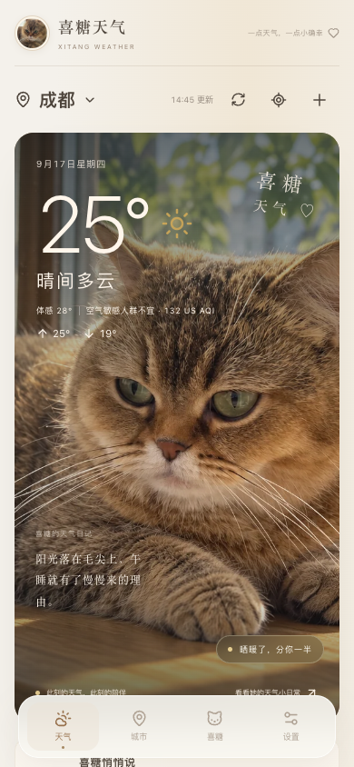
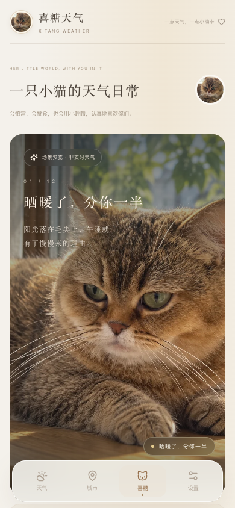

<p align="center">
  
</p>

<h1 align="center">喜糖天气 · Xitang Weather</h1>

<p align="center"><strong>把天气，翻译成一只猫的日常。</strong></p>

<p align="center">
  真实天气决定喜糖的场景、动作与台词。<br />
  抬头看一眼天气，也像回家看了她一眼。
</p>

<p align="center">
  <a href="https://xitangweather.cn/"><strong>打开喜糖天气 ↗</strong></a>
  &nbsp;·&nbsp;
  <a href="showcase/demo.webm">观看手机操作演示</a>
  &nbsp;·&nbsp;
  <a href="docs/portfolio-case-study.md">阅读项目复盘</a>
  &nbsp;·&nbsp;
  <a href="#本地运行">本地运行</a>
</p>

<p align="center">React · TypeScript · Vite · Open-Meteo · iPhone 主屏幕 Web App</p>

<p align="center">
  
  
</p>

## 作品概览

喜糖天气是一款以我家猫咪「喜糖」为主角的天气应用。它保留天气工具该有的准确与清晰：实时天气、体感与高低温、24 小时及未来 7 天预报、城市搜索与收藏、定位、空气质量；同时用 **12 个独立场景**和喜糖的语气，回答一个更有温度的问题：**今天的天气，她会怎么过？**

在 iPhone Safari 打开 [正式网站](https://xitangweather.cn/) 后，可以添加到主屏幕，像 App 一样使用。免登录，家人也能直接打开；城市收藏与偏好保存在各自设备上。

| 天气进入她的生活 | 呈现方式 |
| --- | --- |
| 晴天 / 多云 / 阴天 | 晒太阳、抬头看云、枕爪发呆，每种天气有不同构图 |
| 小雨 / 大雨 / 雷暴 | 透明伞、屋檐、室内避雷；喜糖和天气处在同一个场景里 |
| 雪 / 雾 / 风 | 围巾、雾中探步、被吹动的毛发与环境 |
| 晴夜 / 夜雨 / 高温 | 望月、听雨入睡、四脚朝天躺平 |

场景图以喜糖的真实照片为参考创作，并非实拍；头像使用真实照片。她胆小、挑食、爱睡觉，喜欢虾子和罐头，也常在台词里惦记左凡妈妈与寇大哥。这些细节让天气文案像是同一只猫在说话，而不是随机拼接的句子。

## 我在项目中做了什么

**角色：项目发起人、产品与体验负责人。** 我从自己的生活场景提出产品概念，定义天气信息层级、喜糖的人格和 12 类场景，选择参考照片，逐轮检查视觉与交互，并推动从本地原型到手机可访问的网站。开发过程使用 AI 辅助生成场景、实现代码和测试；我负责提出需求、判断取舍、发现问题、给出修改方向并验收结果。

两个最关键的迭代：

1. **让猫和天气真正成为一幅画。** 初版只是把照片叠在天气背景上，多云与阴天甚至重复用图。我要求每种天气有独立的姿态、道具、光线和环境关系，最终形成 12 个可单独替换的场景。下雨时她在伞下或屋檐内，雪天围巾与雪落在同一画面，天气不再只是盖在照片上的特效。
2. **让作品能被家人真正打开。** 早期分享链接在中国大陆手机上被拦截。我改用自己的域名和腾讯云托管，并为正式版本接入同源天气接口，再检查首页、城市搜索、预报和 iPhone 页面。线上网址是 [xitangweather.cn](https://xitangweather.cn/)；网络可达性会随地区和运营商变化，因此保留了本地运行方式。

这个项目展示的是 **AI 辅助下的产品落地能力**：把模糊想法拆成可实现的功能，建立审美与内容标准，识别失败的版本，反复修改直到真实用户可以使用。它不是把 AI 输出直接当成最终交付，也不把 AI 生成的代码冒充纯手写作品。

## 功能与实现

- **天气数据**：Open-Meteo Forecast、Geocoding 和 Air Quality；不要求用户提供 API Key。天气与空气质量分别处理失败，缺数据时明确显示，不编造温度。
- **场景映射**：WMO 天气代码 → 天气类别 → 城市当地时段 → 喜糖场景 → 画面与台词。雷暴、降雪、降雨等状态有明确优先级，页面无需堆放天气判断。
- **喜糖人格**：天气、温度、时间共同决定台词；有怕雨、贪睡、挑食和惦记家人的口吻，也能在「喜糖」页互动。
- **城市与预报**：搜索全球城市、收藏常用城市、浏览器定位；定位被拒绝时回到成都。提供从当地当前小时起的 24 小时预报和未来 7 天预报。
- **手机体验**：响应式布局、主屏幕图标、离线页面与带时间标记的短期天气缓存；支持系统减少动态效果。

```text
天气代码 → 天气状态 → 城市当地时间 → 喜糖场景
                                      ├─ 可替换的图片素材
                                      ├─ 背景 / 光线 / 动画
                                      └─ 天气 / 温度 / 时间台词
```

场景素材集中在 [`src/assets/xitang/`](src/assets/xitang/README.md)。以后替换 `sunny.webp`、`rain.webp`、`snow.webp` 等文件，无需改首页逻辑。天气请求封装在 `src/services/`，映射与台词在 `src/weather/`，方便继续迭代或迁移到 Tauri。

## 本地运行

需要 Node.js **22.12+** 和 npm。

```bash
npm install
npm run dev
```

打开终端给出的本地地址，默认城市为成都。想检查项目时，可运行：

```bash
npm test           # 天气、场景与台词等逻辑
npm run typecheck  # TypeScript 检查
npm run build      # 生产构建
```

本地开发版直接向 Open-Meteo 请求天气；正式部署版使用同源接口转发请求，以适应实际手机访问环境。部署适配代码在 `server/`，应用本身不需要账号或付费天气 API。

## 验证与边界

2026 年 9 月完成了单元测试、类型检查、生产构建、浏览器功能检查和手机尺寸检查；正式域名的首页、天气与城市查询在当时的大陆节点检查中均正常响应。详细记录与可复现命令见 [验证说明](docs/portfolio-validation.md)。线上服务仍依赖网络和第三方天气数据，不能把某一次测试当作所有运营商长期可用的保证。

这是 **可添加到 iPhone 主屏幕的 Web App**，不是已上架 App Store 的原生应用。空气质量展示的是 **US AQI**，并非中国 AQI；天气来自预报模型而非手机传感器。离线时只显示带时间标记的近期缓存，不把旧数据称为实时天气。

**关于 AI 与素材：** 场景插画由 Image 2 根据喜糖照片辅助创作；项目代码与测试在 Codex 协助下完成，并经过需求调整与人工验收。照片和喜糖形象用于此作品展示，复用图片前请先征得同意。
